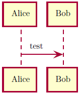
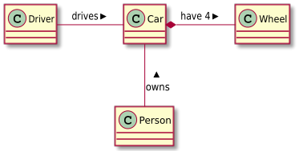

# plantuml [](https://ctan.org/pkg/plantuml)

> A LuaLaTeX package for PlantUML in LaTeX

[PlantUML](http://plantuml.com/) is a program which transforms text into UML diagrams.
This package allows for embedding PlantUML diagrams using the PlantUML source.

Currently, this project runs with [lualatex](http://www.luatex.org/) only.
Check [issue #1](https://github.com/koppor/plantuml/issues/1) for the current state of affairs for support pdflatex.

## Preconditions

1. Environment variable `PLANTUML_JAR` set to the location of `plantuml.jar`.
   You get it from <https://sourceforge.net/projects/plantuml/files/plantuml.jar/download>.
2. Windows: Environment variable `GRAPHVIZ_DOT` set to the location of `dot.exe`.
   Example: `C:\Program Files (x86)\Graphviz2.38\bin\dot.exe`.
   You can install graphviz using `choco install graphviz`.
3. lualatex available with command line parameter `-shell-escape` included.
4. In case you want to have the images as PDFs (and not using TikZ or PNG), ensure that `inkscape.exe` and `pdfcrop` are in your path.
   You can get inkscape using `choco install inkscape`.
   `pdfcrop` should be part of your latex distribution.

## Examples

### Minimal Example

**LaTeX source:**

```latex
\documentclass{scrartcl}
\usepackage{plantuml}
\begin{document}
\begin{plantuml}
  @startuml
  Alice -> Bob: test
  @enduml
\end{plantuml}
\end{document}
```

**Compilation:** `lualatex -shell-escape example-minimal`

**Result:**



### Example Class Relations Rendered Using SVG

**LaTeX source:**

```latex
\documentclass{scrartcl}
\usepackage{graphics}
\usepackage{epstopdf}
\epstopdfDeclareGraphicsRule{.svg}{pdf}{.pdf}{
  inkscape #1 --export-filename=\OutputFile
}
\usepackage[output=svg]{plantuml}
\begin{document}
\begin{plantuml}
@startuml
class Car

Driver - Car : drives >
Car *- Wheel : have 4 >
Car -- Person : < owns
@enduml
\end{plantuml}
\end{document}
```

**For older Inkscape use this LaTeX source:**

```latex
\documentclass{scrartcl}
\usepackage{graphics}
\usepackage{epstopdf}
\epstopdfDeclareGraphicsRule{.svg}{pdf}{.pdf}{
  inkscape -z --file=#1 --export-pdf=\OutputFile
}
\usepackage[output=svg]{plantuml}
\begin{document}
\begin{plantuml}
@startuml
class Car

Driver - Car : drives >
Car *- Wheel : have 4 >
Car -- Person : < owns
@enduml
\end{plantuml}
\end{document}
```

**Compilation:** `lualatex -shell-escape example-class-relations`

**Result:**



## Installation

Your latex distribution should take care.

For manual installation, copy `plantuml.*` to your local texmf folder in the subdirectoy `tex/latex/plantuml`.
See [the discussion at tex.sx](https://tex.stackexchange.com/q/27982/9075) for the concrete location of the folder on your system.

## Development

The release is built using [GitHub Actions](https://github.com/features/actions) ([workflow file](https://github.com/koppor/plantuml/blob/master/.github/workflows/build-and-publish.yml)) using [`release.sh`](release.sh).

Release prepration:

1. Adapt copyright year (line 1) as well as date and version number (line 6) in `plantuml.sty`.
2. Adapt `CHANGELOG.md`.
3. Set a git tag and push.

## Alternative Solutions

[TikZ-UML](https://perso.ensta-paristech.fr/~kielbasi/tikzuml/) is a very powerful package based on [TikZ](https://www.ctan.org/pkg/pgf).
More alternative solutions are collected at the [CTAN topic UML](https://www.ctan.org/topic/uml).

## License

`SPDX-License-Identifier: LPPL-1.3c+`
