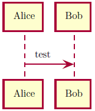
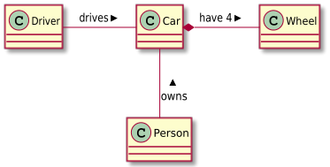

# plantuml [](https://ctan.org/pkg/plantuml)

> A LuaLaTeX and pdfLaTeX package for PlantUML in LaTeX

[PlantUML](http://plantuml.com/) is a program which transforms text into UML diagrams.
This package allows for embedding PlantUML diagrams using the PlantUML source.

It works with both [lualatex](http://www.luatex.org/) and [pdflatex](https://www.tug.org/applications/pdftex/).
Both engines need `-shell-escape` so that the package can call PlantUML.
See [docs/decisions/0001-support-pdflatex-via-shell-escape.md](docs/decisions/0001-support-pdflatex-via-shell-escape.md)
for why pdfLaTeX is driven directly via shell escape ([issue #1](https://github.com/koppor/plantuml/issues/1)).

## Preconditions

1. Environment variable `PLANTUML_JAR` set to the location of `plantuml.jar`.
   You get it from <https://sourceforge.net/projects/plantuml/files/plantuml.jar/download>.
   Not needed when rendering `png`/`svg` through a PlantUML server (see
   [Rendering via a PlantUML server](#rendering-via-a-plantuml-server)).
   If neither a jar nor a server is available, the diagram is replaced by a
   visible placeholder rather than aborting the build.
2. Windows: Environment variable `GRAPHVIZ_DOT` set to the location of `dot.exe`.
   Example: `C:\Program Files (x86)\Graphviz2.38\bin\dot.exe`.
   You can install graphviz using `choco install graphviz`.
3. lualatex or pdflatex available, called with the command line parameter `-shell-escape`.
4. In case you want to have the images as PDFs (and not using TikZ or PNG), ensure that `inkscape.exe` and `pdfcrop` are in your path.
   You can get inkscape using `choco install inkscape`.
   `pdfcrop` should be part of your latex distribution.

## Examples

### Minimal Example

**LaTeX source:**

```latex
\documentclass{scrartcl}
\usepackage{plantuml}
\begin{document}
\begin{plantuml}
  @startuml
  Alice -> Bob: test
  @enduml
\end{plantuml}
\end{document}
```

**Compilation:** `lualatex -shell-escape example-minimal` (or `pdflatex -shell-escape example-minimal`)

**Result:**



### Example Class Relations Rendered Using SVG

**LaTeX source:**

```latex
\documentclass{scrartcl}
\usepackage{graphics}
\usepackage{epstopdf}
\epstopdfDeclareGraphicsRule{.svg}{pdf}{.pdf}{
  inkscape "#1" --export-text-to-path --export-filename="\OutputFile"
}
\usepackage[output=svg]{plantuml}
\begin{document}
\begin{plantuml}
@startuml
class Car

Driver - Car : drives >
Car *- Wheel : have 4 >
Car -- Person : < owns
@enduml
\end{plantuml}
\end{document}
```

**For older Inkscape use this LaTeX source:**

```latex
\documentclass{scrartcl}
\usepackage{graphics}
\usepackage{epstopdf}
\epstopdfDeclareGraphicsRule{.svg}{pdf}{.pdf}{
  inkscape -z --file=#1 --export-pdf=\OutputFile
}
\usepackage[output=svg]{plantuml}
\begin{document}
\begin{plantuml}
@startuml
class Car

Driver - Car : drives >
Car *- Wheel : have 4 >
Car -- Person : < owns
@enduml
\end{plantuml}
\end{document}
```

**Compilation:** `lualatex -shell-escape example-class-relations` (or `pdflatex -shell-escape example-class-relations`)

**Result:**



### Rendering via a PlantUML server

Instead of a local `plantuml.jar`, `png` and `svg` diagrams can be rendered by a
[PlantUML server](https://github.com/plantuml/plantuml-server) over HTTP. This
needs only `curl` — no Java and no local PlantUML installation — which is handy
on CI and shared build machines (see [issue #6](https://github.com/koppor/plantuml/issues/6)).

Point the package at a server with the `server` option:

```latex
\usepackage[output=svg, server=https://www.plantuml.com/plantuml]{plantuml}
```

Alternatively set the `PLANTUML_SERVER` environment variable (the package option
takes precedence over it):

```sh
export PLANTUML_SERVER=https://www.plantuml.com/plantuml
```

You can run your own server, for example with Docker:

```sh
docker run -d -p 8080:8080 plantuml/plantuml-server:jetty
# then use server=http://localhost:8080
```

Notes:

- Only `output=png` and `output=svg` use the server. `output=latex` (TikZ, the
  default) cannot be produced by a server and always uses the local
  `plantuml.jar`, so keep `PLANTUML_JAR` set if you need latex output.
- See [`example-server--png.tex`](example-server--png.tex) and
  [`example-server--svg.tex`](example-server--svg.tex) for complete examples.
- The diagram source is sent hex-encoded in the request URL, so a very large
  diagram may hit the server's URL-length limit.

## Installation

Your latex distribution should take care.

For manual installation, copy `plantuml.*` to your local `texmf` folder in the sub directory `tex/latex/plantuml`.
See [the discussion at tex.sx](https://tex.stackexchange.com/q/27982/9075) for the concrete location of the folder on your system.

## Development

The release is built using [GitHub Actions](https://github.com/features/actions) ([workflow file](https://github.com/koppor/plantuml/blob/master/.github/workflows/build-and-publish.yml)) using [`release.sh`](release.sh).

Release preparation:

1. Adapt copyright year (line 1)
2. Adapt as date and version number (line 6) in `plantuml.sty`.
3. Adapt `CHANGELOG.md`.
4. Set a git tag and push.

## Alternative Solutions

[TikZ-UML](https://perso.ensta-paristech.fr/~kielbasi/tikzuml/) is a very powerful package based on [TikZ](https://www.ctan.org/pkg/pgf).
More alternative solutions are collected at the [CTAN topic UML](https://www.ctan.org/topic/uml).

## License

`SPDX-License-Identifier: LPPL-1.3c+`
