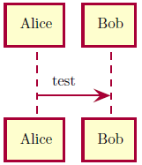
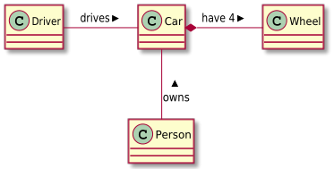

# plantuml [](https://ctan.org/pkg/plantuml)

> A LuaLaTeX and pdfLaTeX package for PlantUML in LaTeX

[PlantUML](http://plantuml.com/) is a program which transforms text into UML diagrams.
This package allows for embedding PlantUML diagrams using the PlantUML source.

It works with both [lualatex](http://www.luatex.org/) and [pdflatex](https://www.tug.org/applications/pdftex/).
Both engines need `-shell-escape` so that the package can call PlantUML.
See [docs/decisions/0001-support-pdflatex-via-shell-escape.md](docs/decisions/0001-support-pdflatex-via-shell-escape.md)
for why pdfLaTeX is driven directly via shell escape ([issue #1](https://github.com/koppor/plantuml/issues/1)).

## Preconditions

1. Environment variable `PLANTUML_JAR` set to the location of `plantuml.jar`.
   You get it from <https://sourceforge.net/projects/plantuml/files/plantuml.jar/download>.
   Not needed when rendering `png`/`svg` through a PlantUML server (see
   [Rendering via a PlantUML server](#rendering-via-a-plantuml-server)).
   If neither a jar nor a server is available, the diagram is replaced by a
   visible placeholder rather than aborting the build.
2. Windows: Environment variable `GRAPHVIZ_DOT` set to the location of `dot.exe`.
   Example: `C:\Program Files (x86)\Graphviz2.38\bin\dot.exe`.
   You can install graphviz using `choco install graphviz`.
3. lualatex or pdflatex available, called with the command line parameter `-shell-escape`.
4. In case you want to have the images as PDFs (and not using TikZ or PNG), ensure that `inkscape.exe` and `pdfcrop` are in your path.
   You can get inkscape using `choco install inkscape`.
   `pdfcrop` should be part of your latex distribution.

## Examples

### Minimal Example

**LaTeX source:**

```latex
\documentclass{scrartcl}
\usepackage{plantuml}
\begin{document}
\begin{plantuml}
Alice -> Bob: test
\end{plantuml}
\end{document}
```

`@startuml` and `@enduml` are optional: when the diagram body omits them,
PlantUML adds them automatically ([issue #4](https://github.com/koppor/plantuml/issues/4)),
so the examples here leave them out. You may still write them explicitly if you
prefer.

**Compilation:** `lualatex -shell-escape example-minimal` (or `pdflatex -shell-escape example-minimal`)

**Result:**



### Rendering from a File

Use `\plantumlinput{<file>}` to render a diagram stored in an external PlantUML
source file, analogous to [minted](https://www.ctan.org/pkg/minted)'s
`\inputminted` and [listings](https://ctan.org/pkg/listings)' `\lstinputlisting`
([issue #3](https://github.com/koppor/plantuml/issues/3)):

```latex
\documentclass{scrartcl}
\usepackage{plantuml}
\begin{document}
\plantumlinput{example-input-file.puml}
\end{document}
```

It honors the `output` mode and reuses the same caching, server, and
`-output-directory` handling as the `plantuml` environment. The file is read
relative to the current working directory, so paths in subdirectories (e.g.
`\plantumlinput{diagrams/foo.puml}`) work when compiling from the project root.
See [`example-input-file.tex`](example-input-file.tex).

### Example Class Relations Rendered Using SVG

**LaTeX source:**

```latex
\documentclass{scrartcl}
\usepackage{graphics}
\usepackage{epstopdf}
\epstopdfDeclareGraphicsRule{.svg}{pdf}{.pdf}{
  inkscape "#1" --export-text-to-path --export-filename="\OutputFile"
}
\usepackage[output=svg]{plantuml}
\begin{document}
\begin{plantuml}
class Car

Driver - Car : drives >
Car *- Wheel : have 4 >
Car -- Person : < owns
\end{plantuml}
\end{document}
```

**For older Inkscape use this LaTeX source:**

```latex
\documentclass{scrartcl}
\usepackage{graphics}
\usepackage{epstopdf}
\epstopdfDeclareGraphicsRule{.svg}{pdf}{.pdf}{
  inkscape -z --file=#1 --export-pdf=\OutputFile
}
\usepackage[output=svg]{plantuml}
\begin{document}
\begin{plantuml}
class Car

Driver - Car : drives >
Car *- Wheel : have 4 >
Car -- Person : < owns
\end{plantuml}
\end{document}
```

**Compilation:** `lualatex -shell-escape example-class-relations` (or `pdflatex -shell-escape example-class-relations`)

**Result:**



### Rendering via a PlantUML server

Instead of a local `plantuml.jar`, `png` and `svg` diagrams can be rendered by a
[PlantUML server](https://github.com/plantuml/plantuml-server) over HTTP. This
needs only `curl` — no Java and no local PlantUML installation — which is handy
on CI and shared build machines (see [issue #6](https://github.com/koppor/plantuml/issues/6)).

Point the package at a server with the `server` option:

```latex
\usepackage[output=svg, server=https://www.plantuml.com/plantuml]{plantuml}
```

Alternatively set the `PLANTUML_SERVER` environment variable (the package option
takes precedence over it):

```sh
export PLANTUML_SERVER=https://www.plantuml.com/plantuml
```

You can run your own server, for example with Docker:

```sh
docker run -d -p 8080:8080 plantuml/plantuml-server:jetty
# then use server=http://localhost:8080
```

Notes:

- Only `output=png` and `output=svg` use the server. `output=latex` (TikZ, the
  default) cannot be produced by a server and always uses the local
  `plantuml.jar`, so keep `PLANTUML_JAR` set if you need latex output.
- See [`example-server--png.tex`](example-server--png.tex) and
  [`example-server--svg.tex`](example-server--svg.tex) for complete examples.
- The diagram source is sent hex-encoded in the request URL, so a very large
  diagram may hit the server's URL-length limit.

### Caching

Generated diagrams are cached by a hash of their source, similar to
[minted](https://www.ctan.org/pkg/minted) and
[memoize](https://www.ctan.org/pkg/memoize). Each diagram is written to
`plantuml-<hash>-converted-to.<ext>`, and PlantUML (or the server) is invoked
only when no file for that hash exists yet. Unchanged diagrams — as well as
repeated or reordered ones — reuse the cached output, so recompiles are fast and
only edited diagrams are regenerated. The `-converted-to` suffix means the
standard [TeX `.gitignore`](https://github.com/github/gitignore/blob/main/TeX.gitignore)
already ignores these files (via `*-converted-to.*`), so no extra entry is
needed. Delete the `plantuml-*-converted-to.*` files to clear the cache.

### Global Preamble

The default PlantUML style is colorful, which is not ideal for printouts. Instead
of repeating `skinparam` settings in every diagram, set a **global preamble** once
that is applied to all diagrams ([issue #5](https://github.com/koppor/plantuml/issues/5)).

Write it inline with the `plantumlpreamble` environment:

```latex
\begin{plantumlpreamble}
skinparam monochrome true
skinparam backgroundColor white
skinparam defaultFontName sans-serif
\end{plantumlpreamble}
```

…or keep it in a file and point at it with `\plantumlpreamblefile{<file>}`. Either
form affects every diagram that follows (set it once near the top of the
document). The preamble is folded into the diagram cache key, so changing it
regenerates the diagrams. See [`example-preamble.tex`](example-preamble.tex).

The local jar applies the preamble to every diagram via PlantUML's `-config`. The
PlantUML server has no such option, so there the preamble is prepended to the
source instead; this styles the usual marker-less diagrams, but a server diagram
that spells out its own `@startuml`/`@enduml` keeps the default style (render it
through the local jar if you need the preamble applied).

### Captions and Labels

Diagrams can carry a numbered, `\ref`-able caption ([issue #8](https://github.com/koppor/plantuml/issues/8)).
The options are:

- `caption={...}` — the caption text,
- `label={...}` — a `\label` for cross-references,
- `float` — place the diagram in a floating `figure` (optional placement, e.g.
  `float=htbp`; `float=H` needs the `float` package). Without `float` the diagram
  and its caption are typeset **in place** (no floating), like listings'
  `caption=` — which avoids the erratic placement of a bare `figure`.

`\plantumlinput` takes these as an optional argument:

```latex
\plantumlinput[caption={A diagram from a file.}, label={fig:demo}]{diagram.puml}
```

The `plantuml` environment can't take an optional argument (a verbatim
environment without a mandatory argument can't carry one), so set the options for
the next environment with `\plantumlset`, in the spirit of `\lstset`:

```latex
\plantumlset{caption={A sequence diagram.}, label={fig:seq}}
\begin{plantuml}
Alice -> Bob: hi
\end{plantuml}
```

See [`example-caption.tex`](example-caption.tex).

### Diagram Font (latex/TikZ output)

With the default `output=latex` (TikZ), PlantUML computes each box's size using a
**sans-serif** font, then emits TikZ that your document typesets. If that text is
set in the document's default (serif) font, it doesn't fit the boxes and the
margins look uneven ([issue #14](https://github.com/koppor/plantuml/issues/14)).
The package therefore renders the diagram text with `\PlantUmlTikzFont`, which
defaults to `\sffamily` so the text matches the boxes. Change it if needed:

```latex
\renewcommand\PlantUmlTikzFont{\rmfamily}  % serif, e.g. to match a serif skinparam
\renewcommand\PlantUmlTikzFont{}           % use the surrounding document font
```

`png`/`svg` output is unaffected (PlantUML renders the text itself), so it is the
simplest choice when exact text fit matters. See [`example-mindmap.tex`](example-mindmap.tex).

### Beamer

The package works in `beamer` ([issue #11](https://github.com/koppor/plantuml/issues/11)).
The only requirement is that any frame containing a `plantuml` environment is
declared `[fragile]`, because the environment captures its body verbatim:

```latex
\documentclass{beamer}
\usetheme{moloch}
\usepackage{plantuml}
\begin{document}
\begin{frame}[fragile]{PlantUML in Beamer}
\begin{plantuml}
Alice -> Bob: Authentication Request
Bob --> Alice: Authentication Response
\end{plantuml}
\end{frame}
\end{document}
```

Without `[fragile]` you get errors such as `Paragraph ended before
\beamer@doframe was complete`. See [`example-beamer.tex`](example-beamer.tex).

## Installation

Your latex distribution should take care.

For manual installation, copy `plantuml.*` to your local `texmf` folder in the sub directory `tex/latex/plantuml`.
See [the discussion at tex.sx](https://tex.stackexchange.com/q/27982/9075) for the concrete location of the folder on your system.

## Development

The release is built using [GitHub Actions](https://github.com/features/actions) ([workflow file](https://github.com/koppor/plantuml/blob/master/.github/workflows/build-and-publish.yml)) using [`release.sh`](release.sh).

Release preparation:

1. Adapt copyright year (line 1)
2. Adapt as date and version number (line 6) in `plantuml.sty`.
3. Adapt `CHANGELOG.md`.
4. Set a git tag and push.

## Alternative Solutions

[TikZ-UML](https://perso.ensta-paristech.fr/~kielbasi/tikzuml/) is a very powerful package based on [TikZ](https://www.ctan.org/pkg/pgf).
More alternative solutions are collected at the [CTAN topic UML](https://www.ctan.org/topic/uml).

## License

`SPDX-License-Identifier: LPPL-1.3c+`
